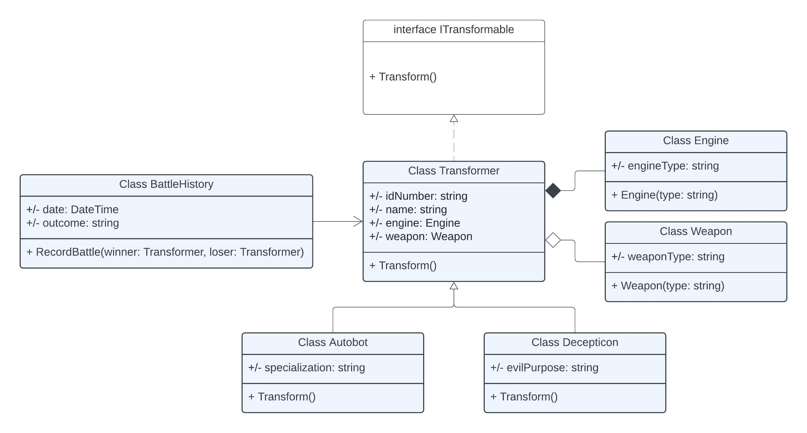

# Світ Трансформерів

## Опис предметної області

Світ Трансформерів - це фантастична всесвіт, де існують розумні роботи зі здатністю трансформуватися в різні транспортні засоби. Ці істоти поділяються на дві основні фракції:

### Автоботи

Автоботи - це захисники свободи, які трансформуються в цивільну техніку та відомі своєю відданістю та сміливістю.

### Десептикони

Десептикони - це фракція, що прагне влади та домінування, трансформуючись у військову техніку.

Обидві сторони знаходяться у вічній боротьбі за долю Всесвіту.

## Діаграма класів

Ось як взаємодіють ключові компоненти світу Трансформерів на діаграмі класів:

На діаграмі класів відображено наступні відносини:

- Клас `Transformer` є базовим для `Autobot` та `Decepticon`.
- Інтерфейс `ITransformable` описує здатність до трансформації.
- Клас `Engine` та `Weapon` є частинами `Transformer`, показуючи відносини композиції та агрегації.
- Клас `BattleHistory` асоціюється з `Transformer`, відображаючи історію битв.

## Розробка

Ця модель дозволяє програмістам та дизайнерам глибше зануритися в світ Трансформерів, створюючи ігри та програми, засновані на цій всесвіті.
